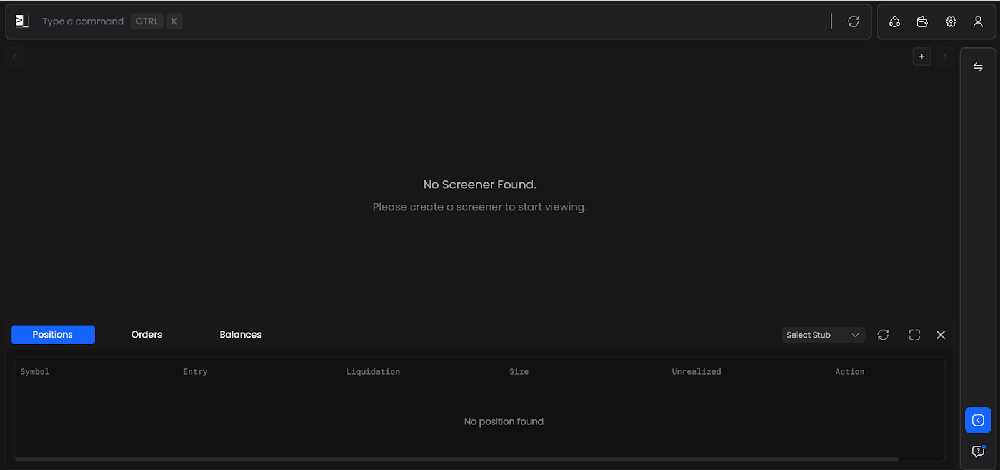
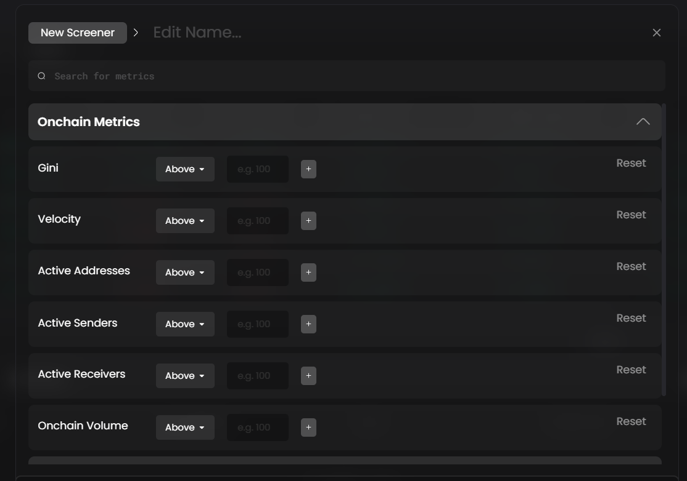
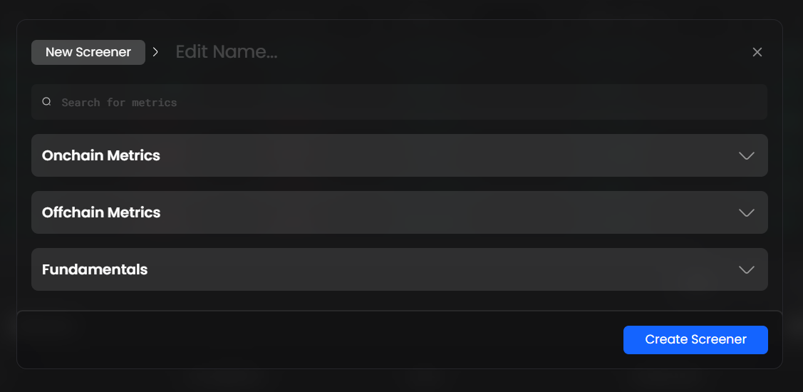
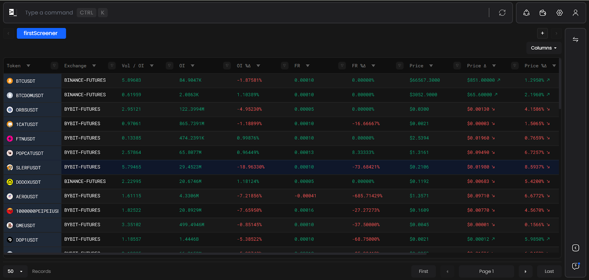
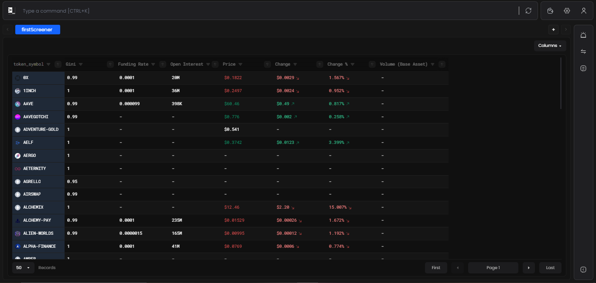
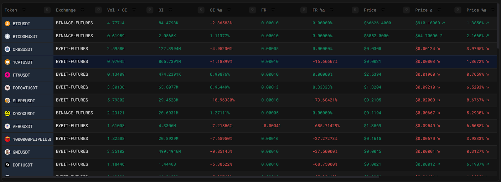
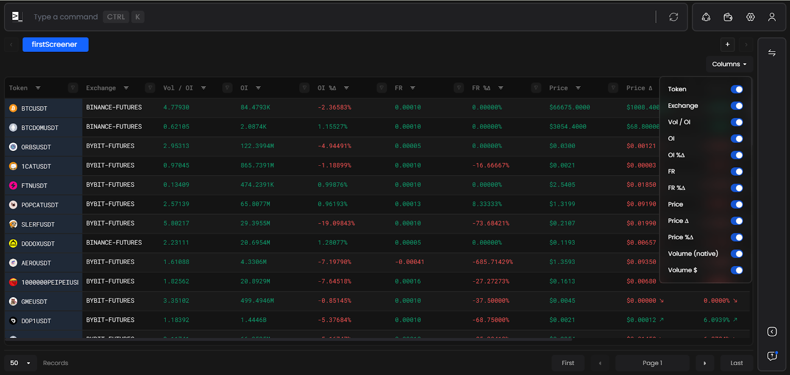
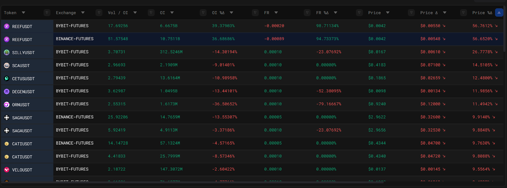
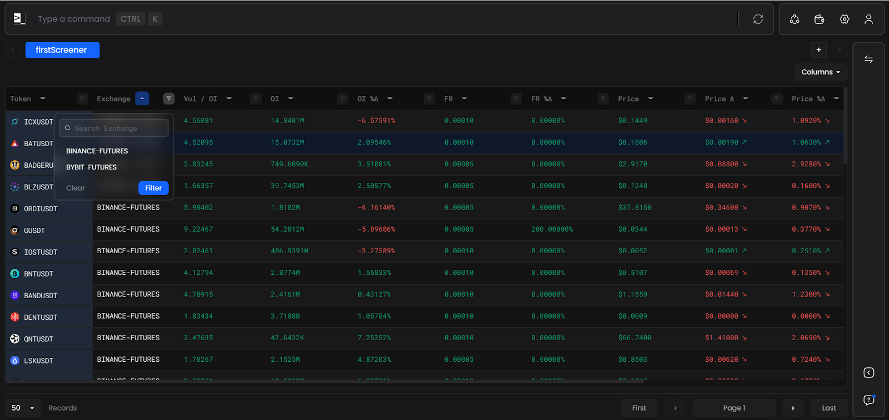

# Creating a Screener

To start working in the Screener, type the following command in the terminal `sc`

## Navigating and Creating a Screener for Token Metrics

1. Click on the ‘+’ Icon on the toolbar.
   

2. Edit the name for your screener, And select the various metrics, with the desirable constraints that you want to filter the table using.
   
   
3. Note - When the combination for your metrics filter fails to match any token information, Your Screener will return No Data. Please make sure that the conditions are valid and definitive.

4. Once your screener is set up successfully, It should look something like this.

5. By Default, you screener view is set to have distribution against the following columns.

6. You can add and remove columns by clicking on the "Column" button, where you can toggle them to view or hide.

 7. You can do customizations and add constraints within the table.

