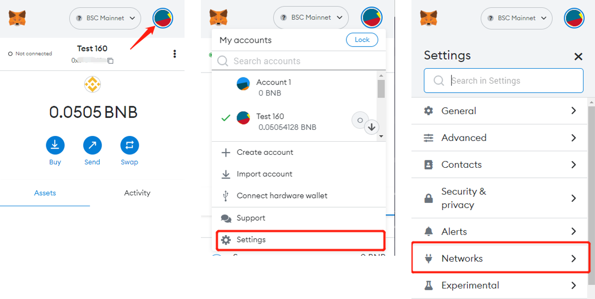
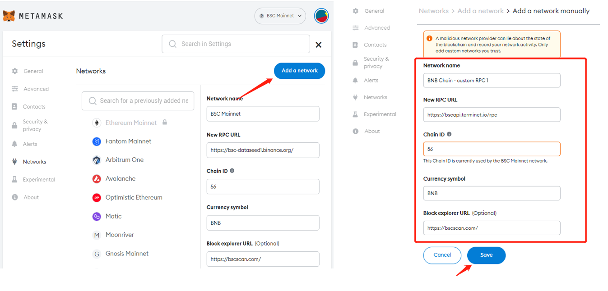
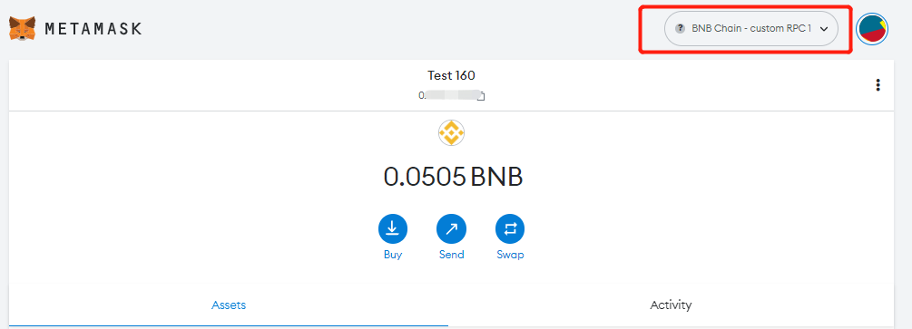

# Adjust RPCs on MetaMask

It shows users how to switch RPC to improve user experience while facing high volume on the network sometime. The following steps will guide you through the process of changing custom RPC endpoint on your MetaMask wallet:

1. Enter your MetaMask and click your account details. Click the 'Settings' then 'Networks'.
   
2. Next, on the expanded Settings, click 'Add a network', then paste the copied RPC URL from Chainlist under 'New RPC URL’. You can name the network whatever you prefer, and enter the correct Chain ID and Currency Symbol. Click 'Save'.
   

3. That's it, now you have connected to the custom RPC endpoint in your wallet.
   
