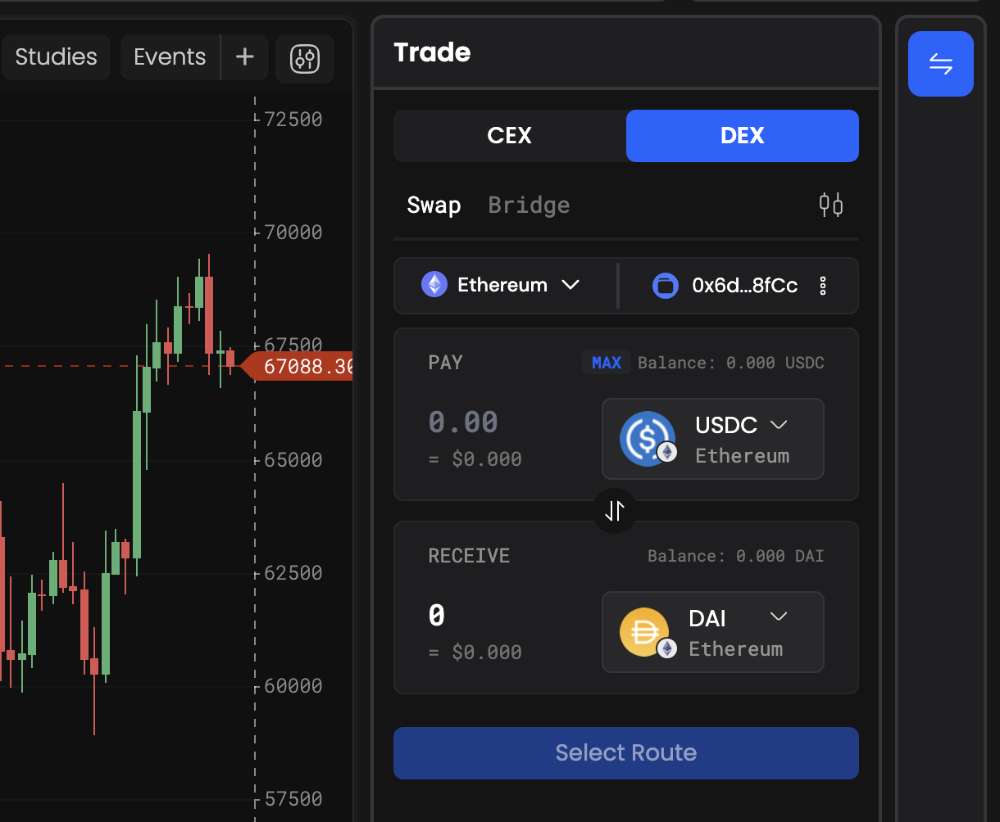
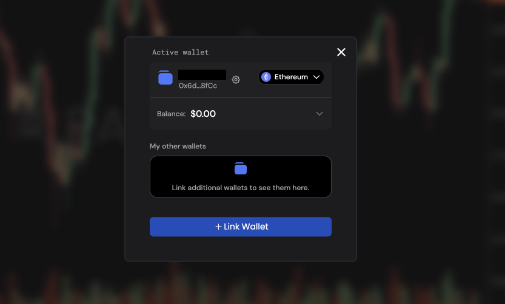

# Connecting your Wallet

To get started to trade DEX, you will need to set up a wallet that supports the blockchain you would like to trade on.

:::info
By default, PANDA Terminal creates an embedded wallet linked to your account. When you navigate to the DEX page for the first time, this embedded wallet will be displayed.

To start using the default wallet, copy your wallet address and deposit funds using external wallets. The exact same process can be used to trade using default wallet also.
:::

If you wish to change your wallet, please follow these simple steps:

In the following example, we will use Metamask Wallet as examples. You can use a similar process to set up the various wallets across blockchains

1. Click on the embedded wallet icon widget, or the 'Wallet' icon on the top-right navigation panel.
   
2. Click on 'Link Wallet', and choose MetaMask.

3. Then on the pop-up wallet window, click Confirm button to connect to PANDA Terminal site.

