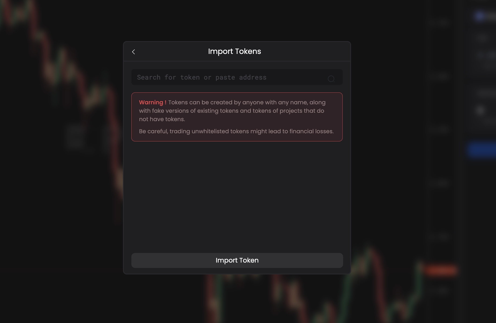

# Custom Tokens

## When trading custom tokens, please read and confirm the following important notices carefully:

1. All tokens have their own smart contracts. PANDA Terminal lists tokens for trading that have been whitelisted as such. By entering the contract address and importing custom tokens, you potentially open yourself up to increased risk.

2. Anyone is able to make a custom token contract, some tokens may mimic the appearance of real tokens, some may be named after projects which don't have a native token and could even be considered malicious.

3. PANDA Terminal has no way of verifying custom token addresses and it’s for this reason we strongly recommend that only those who have an understanding of the risks involved and are able to verify the custom token contracts in the corresponding chain explorer to import custom tokens.

4. **Trade at your own risk!**

