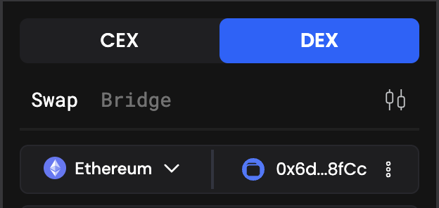
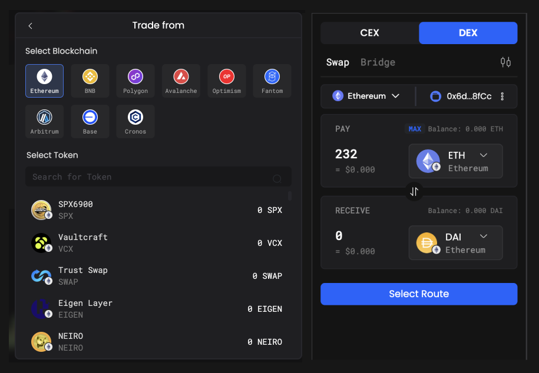
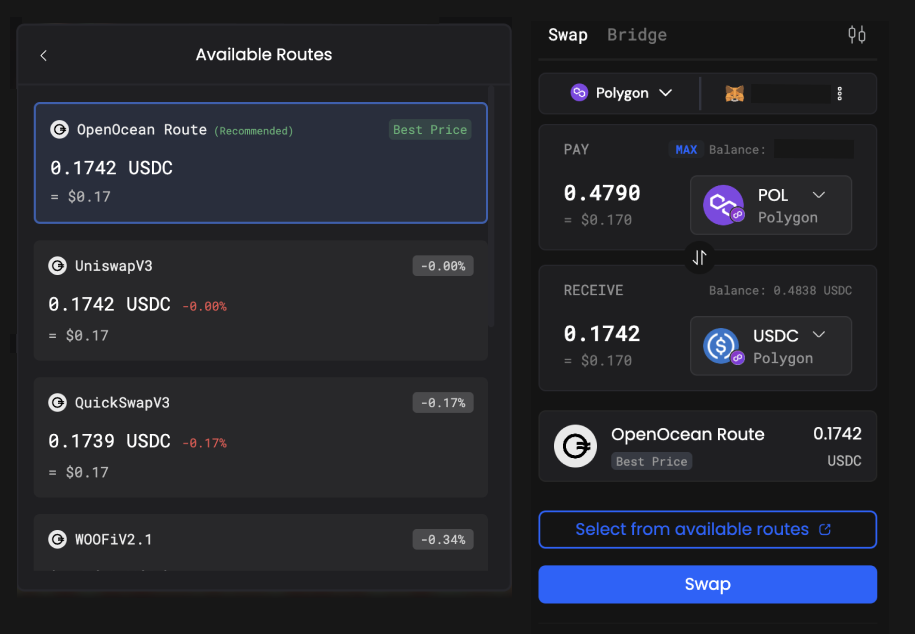

# Swap Tokens

First time using PANDA Terminal? Don't worry! We are here to provide you a handy tutorial to guide you how to initiate swaps on PANDA Terminal. In the following example, we will use BNB Chain and MetaMask wallet as an example. _For other supported blockchains, you may follow a similar way_

**Alright, let's get started!**

1. Go to the PANDA Terminal DEX trading.

2. Choose the network - Ethereum (as example) on the top right corner dropdown list you want to swap on. You can choose to change your wallet from the default embedded wallet for swapping.
   
3. Choose the token you want to swap from the token dropdown list in the "From" section, then enter the amount you want to trade.

You can either choose to trade any custom token by pasting the token address on the search bar or any trending/avail./favorite tokens in your list. Then, choose the token you want to trade to in the "To" section.

4. If the tokens you try to swap are non-native token, you must unblock the specific amount of tokens first or choose infinite unblock. Then click "Confirm" on MetaMask pop-up window. Check the details, and click the Select Route button.

5. After clicking ‘’Select Route", the best route suggestion will appear on the UI. You can browse all the available options using "Select from available routes".

   

6. Check the details are correct, then click the Confirm Order button. Your wallet will ask you to confirm this action, and your swap is executed successfully!
