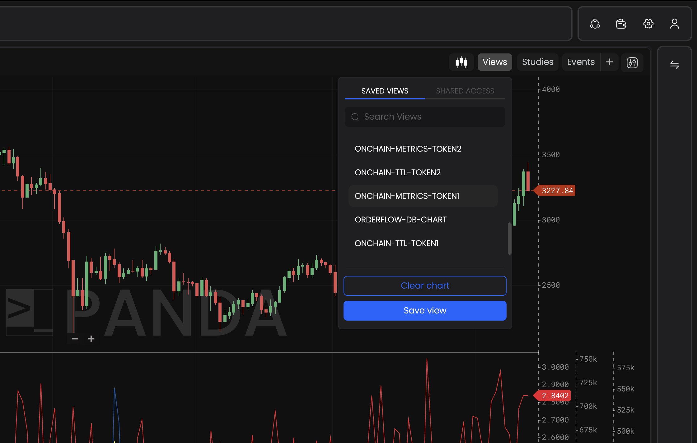

import Tabs from "@theme/Tabs";
import TabItem from "@theme/TabItem";

# Saving & Resaving a Workbench

PANDA Terminal allows you to save your chart layouts, templates, drawings, and indicators so you can easily restore them whenever needed. These saved configurations are stored in your Views and can be applied at any time.

## How to Save a Chart Layout

- **Create your desired view**: Add all the suitable configuration to your chart.
- **Save Your Configuration**: Click it to save your current chart layout, including all templates and indicators.

<Tabs>
  <TabItem value="cmd" label="Save Views using command" default>
    <ul>
      <li>
        <b>Save Your Configuration</b>: With the chart view you wish to save
        active, run the following command
        

          <code>wb save [name-of-the-workbench]</code>
        

      </li>
    </ul>
    <video width="800" height="500" autoPlay loop>
      <source
        src="https://assets.pandaterminal.com/documentation_clips/resave%20using%20command.mov"
        type="video/mp4"
      ></source>
    </video>
  </TabItem>
  <TabItem value="gui" label="Save Views using GUI">
    <video width="800" height="500" autoPlay loop>
      <source
        src="https://assets.pandaterminal.com/documentation_clips/resavingChart_using_GUI.mov"
        type="video/mp4"
      ></source>
    </video>
  </TabItem>
</Tabs>

## Updating a Saved Chart Configuration

- **Make Your Changes**: Adjust your chart as desired.
- **Resave**: Click the Save icon again to update your saved configuration with the new changes.

<Tabs>
  <TabItem value="cmd" label="Resave views using command" default>
    <video width="800" height="500" autoPlay loop>
      <source
        src="https://assets.pandaterminal.com/documentation_clips/resave using command.mov"
        type="video/mp4"
      ></source>
    </video>
  </TabItem>
  <TabItem value="gui" label="Resave views using the GUI">
    <video width="800" height="500" autoPlay loop>
      <source
        src="https://assets.pandaterminal.com/documentation_clips/resavingChart_using_GUI.mov"
        type="video/mp4"
      ></source>
    </video>
  </TabItem>
</Tabs>{" "}

## Loading a Saved Chart Layout

- **Navigate to Views**: Go to the Views section in the platform.
- **Select Your Layout**: Find and select the chart layout you want to load from your list of saved charts.

This feature makes it easy to switch between different chart setups and ensures your favorite configurations are always accessible.
