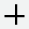

# Charting Tools

There are various charting tools that can help you draw on your chart, and analyze your chart more briefly. Let's talk about each in detail.

## Drawing Tool

Trend lines, average lines, channels, Fibonacci retracements, arrows, callouts, doodles — an extensive set of drawing and styling tools enable you to creatively highlight and graphically analyze charts and studies.

## Select the Draw Control to Open the Drawing Palette.

    <video width="800" height="500" autoPlay>
      <source
        src="https://assets.pandaterminal.com/documentation_clips/Drawing_tool.mov"
        type="video/mp4"
      ></source>
    </video>

## Drawing Palette

| Category       | Icon                                                             | Tool/Annotation & Description                                                                                              |
| -------------- | ---------------------------------------------------------------- | -------------------------------------------------------------------------------------------------------------------------- |
| **Text**       |            | **Annotation**                                                                                                             |
|                |                  | **Callout**                                                                                                                |
| **Statistics** |                | **Average Line** - Average line drawings can be applied to any rendered series or study line, not just the primary series. |
|                |        | **Measurement Line**                                                                                                       |
|                |             | **Quadrant Lines**                                                                                                         |
|                |        | **Regression Line**: Option to show 1st, 2nd, and 3rd standard deviation lines on the regression drawings.                 |
|                |          | **Tirone Levels**                                                                                                          |
|                |          | **Volume Profile by Date Range**                                                                                           |
| **Technicals** |                | **Gann Fan**                                                                                                               |
|                |                  | **Gartley**                                                                                                                |
|                |              | **Pitchfork**                                                                                                              |
|                |    | **Speed Resistance Arc**                                                                                                   |
|                |  | **Speed Resistance Line**                                                                                                  |
|                |            | **Time Cycle**                                                                                                             |
|                |          | **Elliott Wave** (see Drawing Elliott Waves below)                                                                         |
| **Lines**      |                  | **Channel**                                                                                                                |
|                |            | **Continuous**                                                                                                             |
|                |              | **Crossline**                                                                                                              |
|                |                    | **Doodle**                                                                                                                 |
|                |                      | **Horizontal Line**                                                                                                        |
|                |                        | **Line**                                                                                                                   |
|                |                          | **Ray**                                                                                                                    |
|                |            | **Trend Line**                                                                                                             |
|                |      | **Vertical Line**                                                                                                          |
| **Fibonacci**  |          | **Fibonacci Retracement**                                                                                                  |
|                |          | **Fibonacci Projection**                                                                                                   |
|                |                  | **Fibonacci Arc**                                                                                                          |
|                |                  | **Fibonacci Fan**                                                                                                          |
|                |        | **Fibonacci Time Zone**                                                                                                    |
| **Markings**   |                  | **Ellipse**                                                                                                                |
|                |                        | **Rectangle**                                                                                                              |
|                |                      | **Arrow**                                                                                                                  |
|                |                      | **Check**                                                                                                                  |
|                |                      | **Cross**                                                                                                                  |
|                |                      | **Focus**                                                                                                                  |
|                |                      | **Heart**                                                                                                                  |
|                |                        | **Star**                                                                                                                   |

## Crosshair

Select the crosshairs icon to show horizontal and vertical lines that follow the mouse. Crosshairs enable you to easily identify values on the x- and y-axes.

    <video width="800" height="500" autoPlay>
      <source
        src="https://assets.pandaterminal.com/documentation_clips/crosshair_gif.mov"
        type="video/mp4"
      ></source>
    </video>

## Info Display

Select the Info icon to show detailed information about individual data points. The default display shows, date, price, open, high, low, close, and volume. Data points are selected by moving the mouse over the time series.

    <video width="800" height="500" autoPlay>
      <source
        src="https://assets.pandaterminal.com/documentation_clips/InfoDescriptions.mov"
        type="video/mp4"
      ></source>
    </video>
