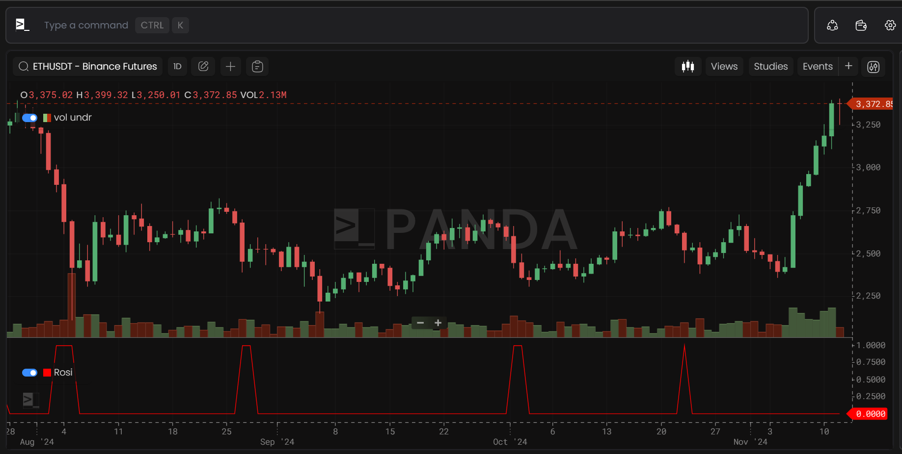
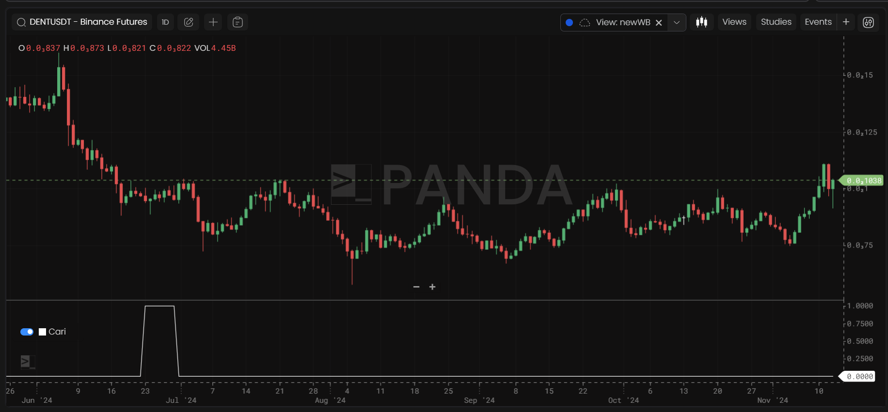
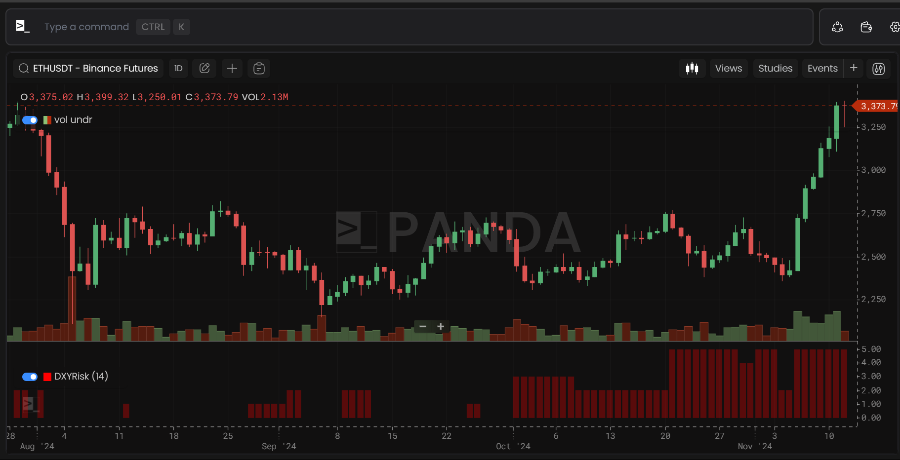

# Jlabs Models

## Rosi

Rosi is a metric that gives you a signal to enter the Market. It is a 4 Hour Chart.

- **Available Symbols**:  
  `BTCUSDT, ETHUSDT, MATICUSDT, LINKUSDT, BNBUSDT, XRPUSDT, LDOUSDT, ADAUSDT, DOGEUSDT, SOLUSDT, LTCUSDT, DOTUSDT, AVAXUSDT, UNIUSDT, ATOMUSDT, FILUSDT, APTUSDT, ARBUSDT, VETUSDT, APEUSDT, AAVEUSDT, OPUSDT, FTMUSDT, THETAUSDT, AXSUSDT, CRVUSDT, MKRUSDT, GMXUSDT`

## Cari

CARI is a metric to denote price reversion signals. It is a Daily chart.

- **Available Symbols**:  
  `  BTCUSDT, ETHUSDT`

## DXYRisk

DXY Risk is a metric to get a risk score for BTC and ETH to predict price action depending on DXY. It is a Daily chart.

- **Available Symbols**:  
  `General Metric, Independent of symbols`.

