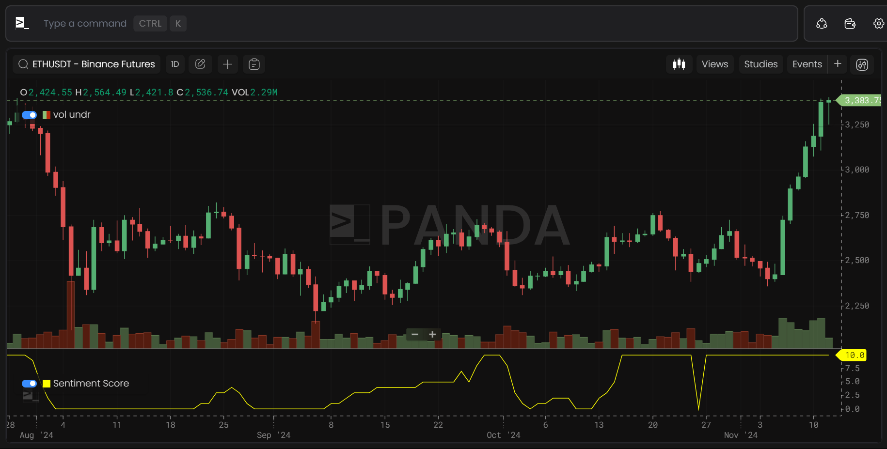

# Jlabs Token Ratings

## Price Strength

Scores the strength of the price trend from 1 to 10.

## User Score

Tracks wallet activity on the network.

## Demand Shock Score

Rates the strength of demand for blockspace on a 1-10 scale.

## Price Level Score

Indicates optimal price levels for network interactions.

## Accumulation Score

Tracks significant wallet sizes for each token.

## Diversity Score

Rates the distribution of a token across protocols and platforms, reflecting usage diversity.

## Token Usage Score

Measures on-chain trends in token utility, including staking, DeFi, and bridging.

## Sentiment Score

Scores online sentiment toward the token from 1 to 10.

## Leverage Score

Rates leverage growth or decline within the token’s network on a 1-10 scale.

## Overall Rating

An aggregate score of all token metrics, filtering noise to highlight macro trends.

