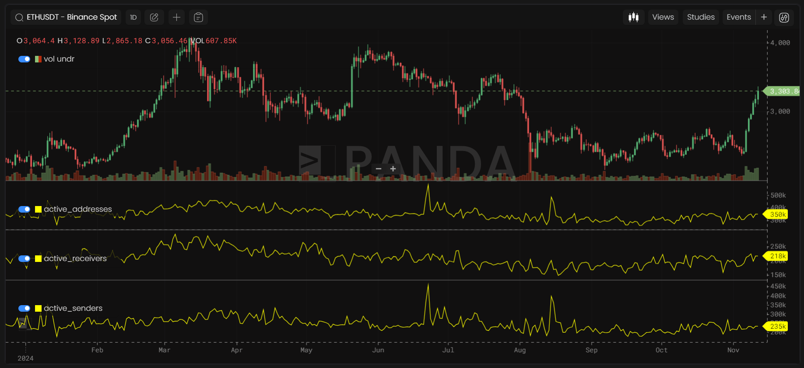
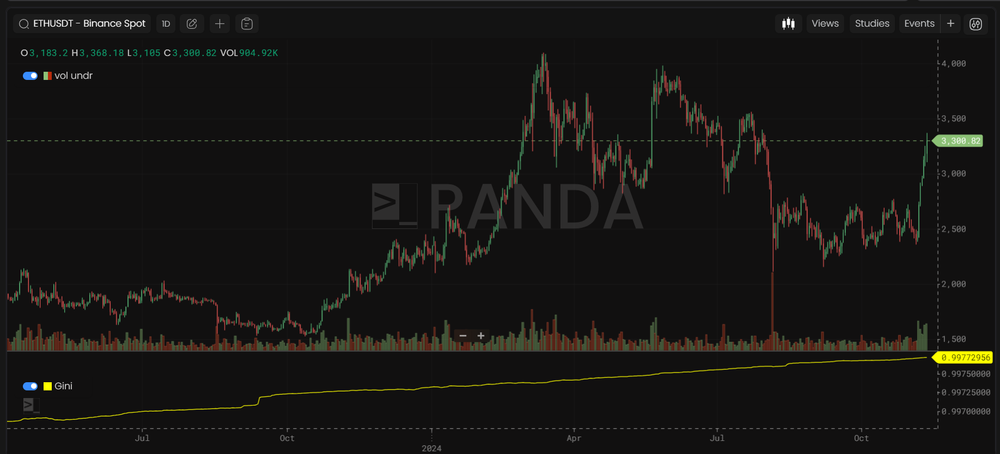
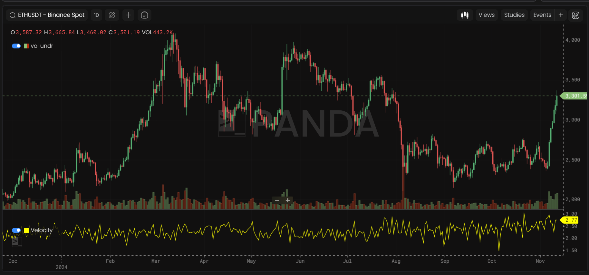
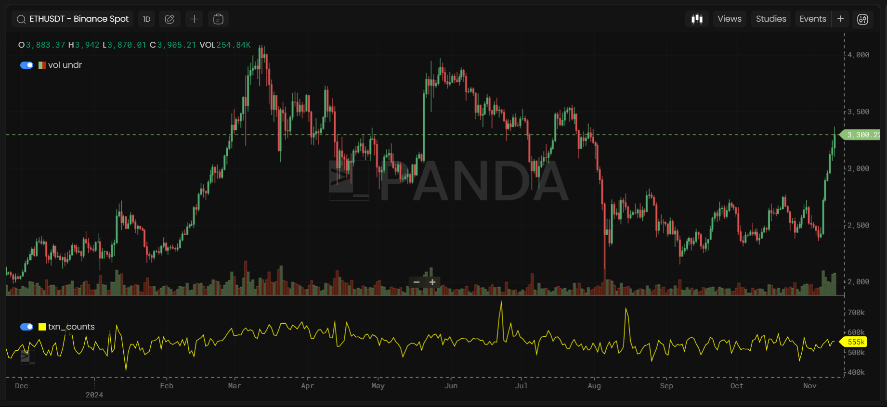
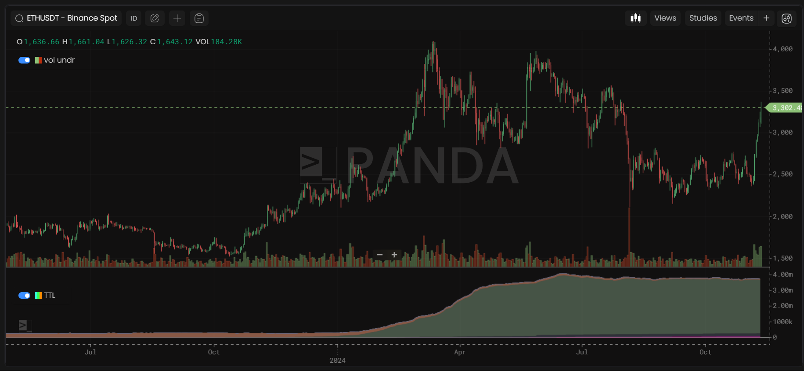
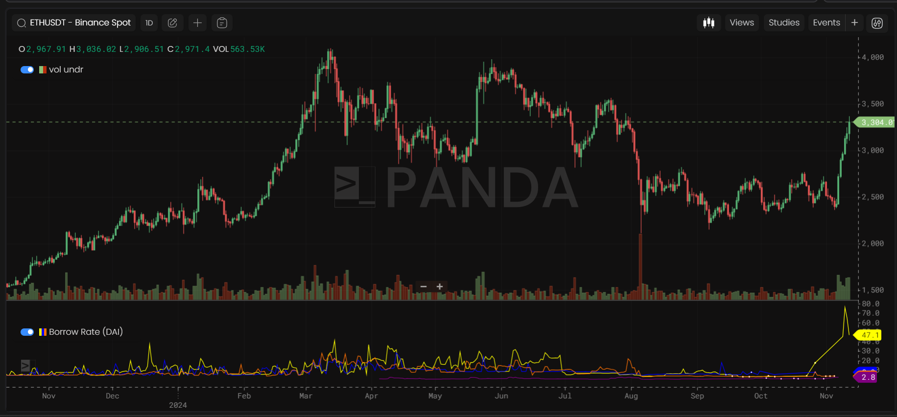
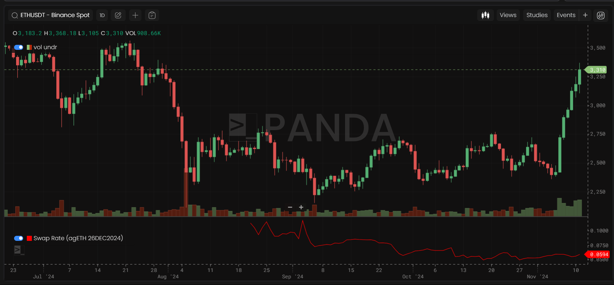

# Onchain Metrics

Onchain Metrics are daily metrics.

## Active Addresses

Measures the daily count of unique addresses interacting with a token, either through sending or receiving.

## Active Senders

Captures the daily count of unique addresses that have sent the token.

## Active Receivers

Reflects the daily count of unique addresses that have received the token.

## Gini

Indicates wealth distribution among addresses for a token; a higher Gini score suggests greater inequality and potential system instability.

## Velocity

_Definition in progress._

## Transaction Counts

Reports the total daily transactions for the token.

## Total Tokens Locked (TTL)

Represents the total amount of the token locked within the protocol.

## Borrow Rate

Defines the interest rate for borrowing the token, typically driven by supply-demand dynamics.

## Swap Rate

Indicates the token’s exchange rate within the protocol, based on market conditions and liquidity.

