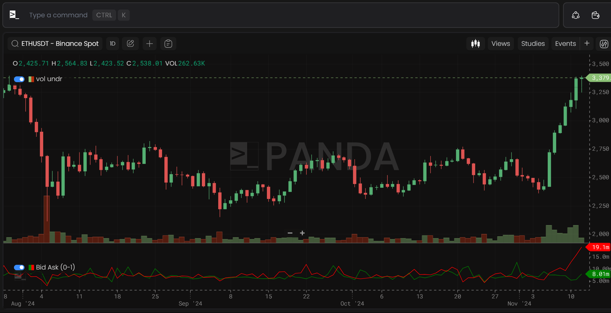
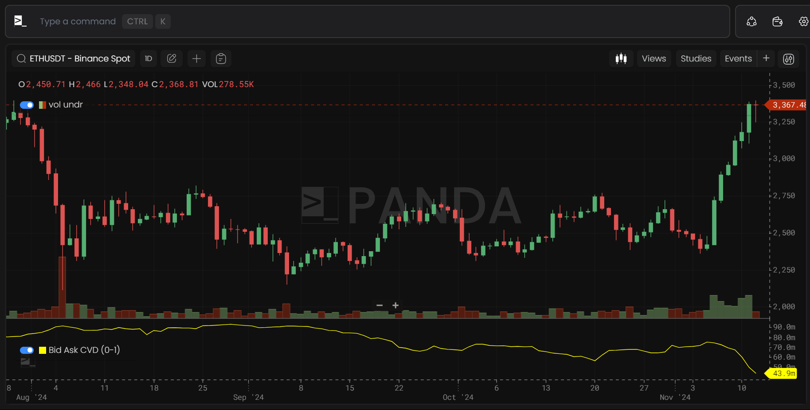
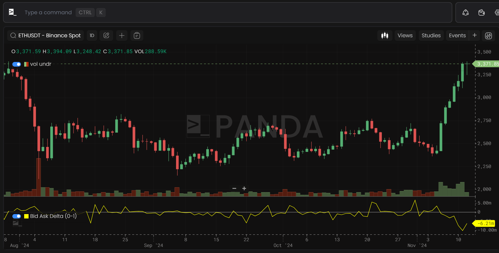
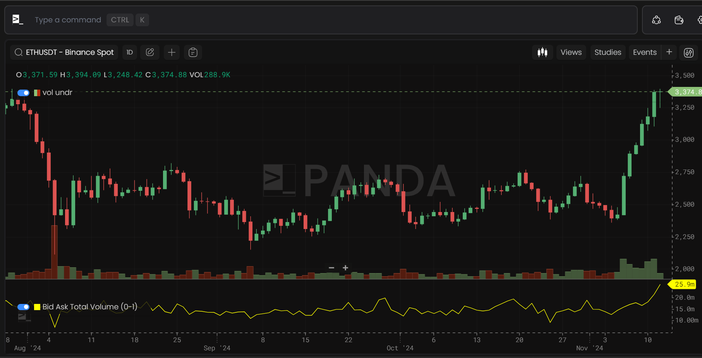
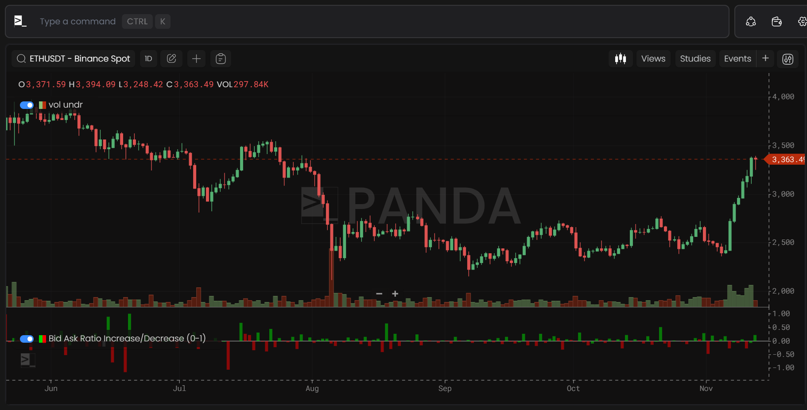
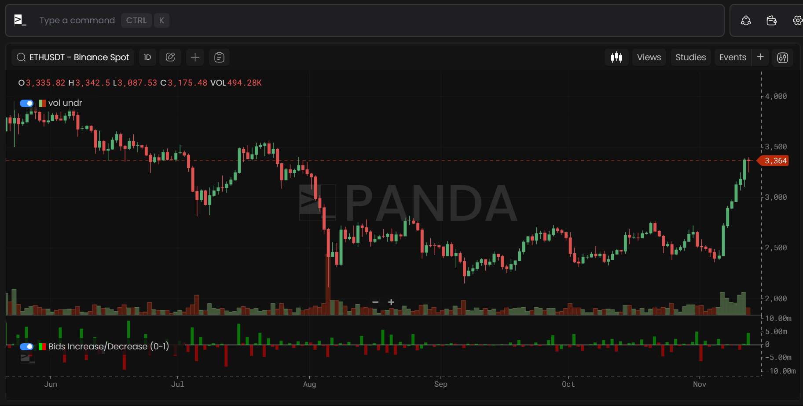
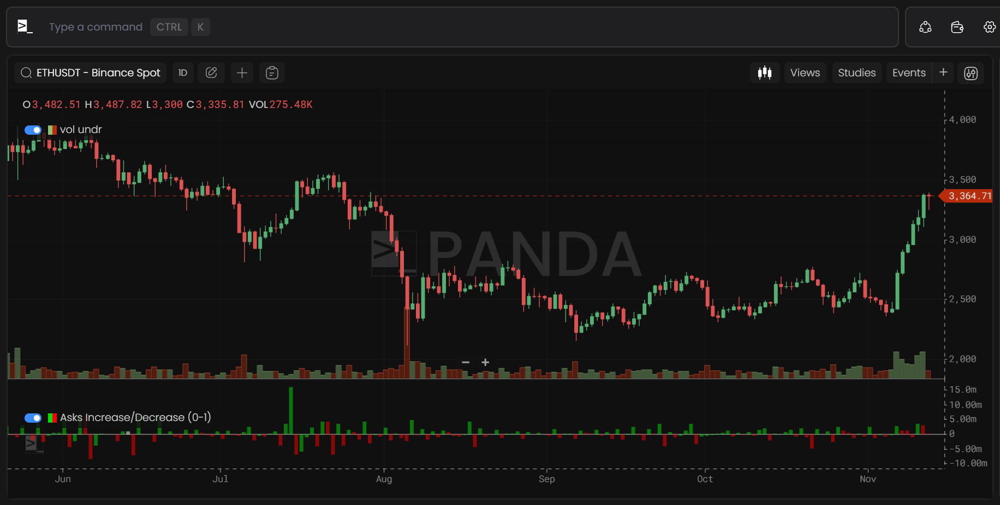

# Orderbook Metrics

Orderbook metrics have a time period of ≥1 minute and are supported on Binance & ByBit (Spot & Futures).

## Bid Ask Ratio

Measures the bid-ask ratio for a specific ticker on a given exchange.

## Bid Ask

Indicates the bid and ask volumes for a specific ticker on a given exchange.

## Bid Ask CVD

Tracks the cumulative volume delta between bids and asks for a specific ticker on a given exchange.

## Bid Ask Delta

Represents the volume delta between bids and asks for a specific ticker on a given exchange.

## Bid Ask Total Volume

Shows the total bid and ask volumes for a specific ticker on a given exchange.

## Bid Ask Ratio Increase/Decrease

Captures increases or decreases in the bid-ask ratio for a specific ticker on a given exchange per candle.

## Bids Increase/Decrease

Reflects increases or decreases in bid volume for a specific ticker on a given exchange per candle.

## Asks Increase/Decrease

Reflects increases or decreases in ask volume for a specific ticker on a given exchange per candle.

