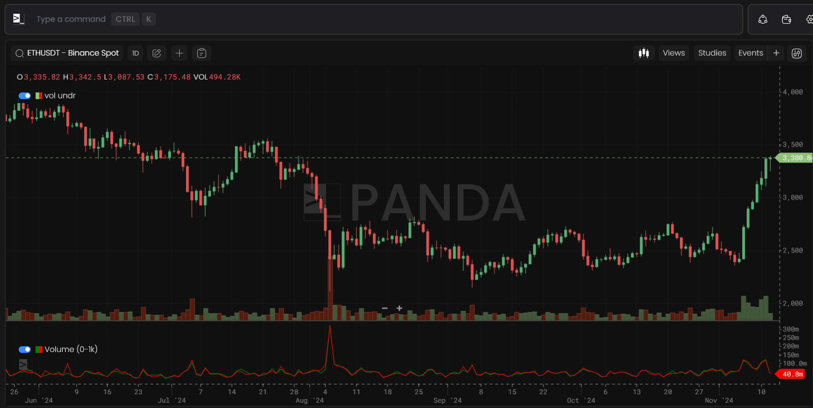
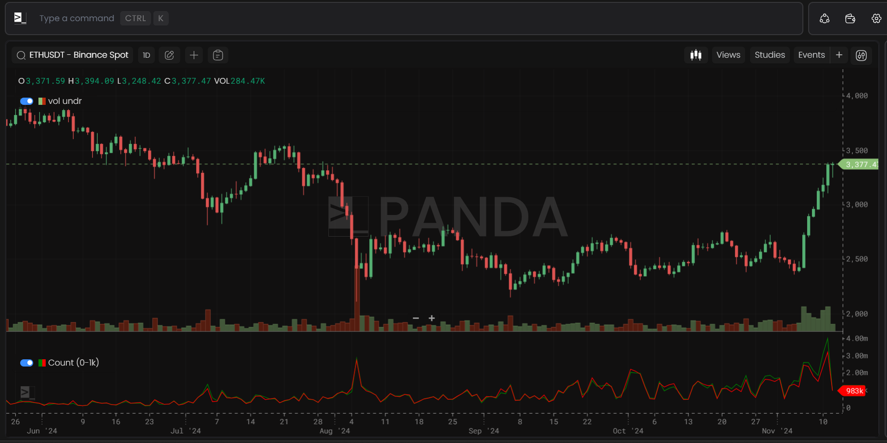
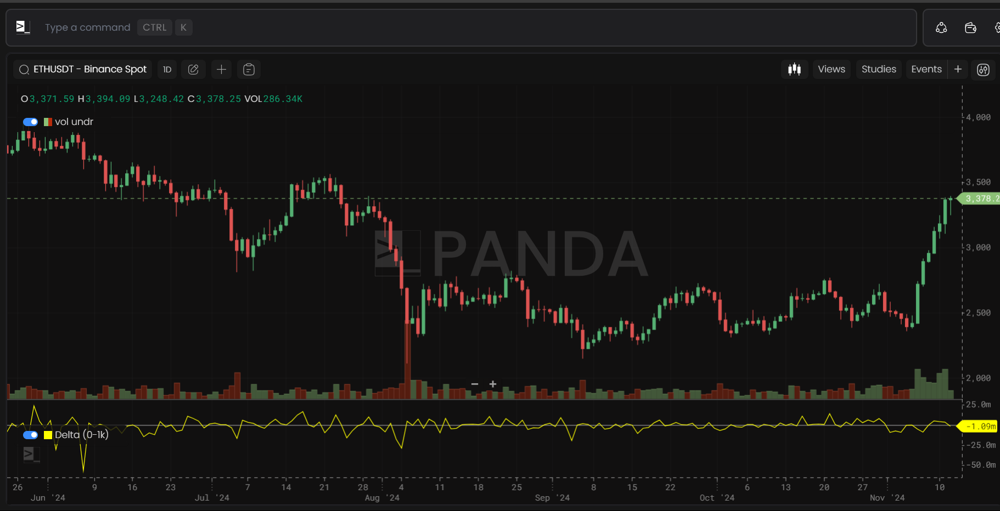
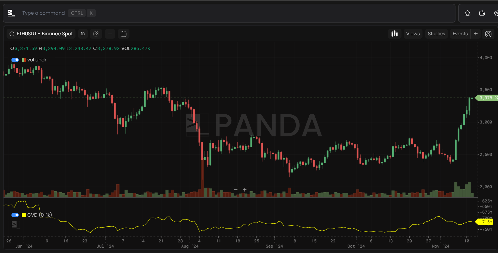

# Orderflow Metrics

Orderflow metrics have a time period of ≥1 minute and are available for tokens on Bybit, Binance - Spot, and Futures.

## Volume

Provides tiered trade book volume for various symbols.

## Count

Shows the tiered trade book count for different symbols.

## Delta

Reflects the tiered trade book volume delta for symbols.

## CVD (Cumulative Volume Delta)

Displays the tiered trade book cumulative volume delta for symbols.

